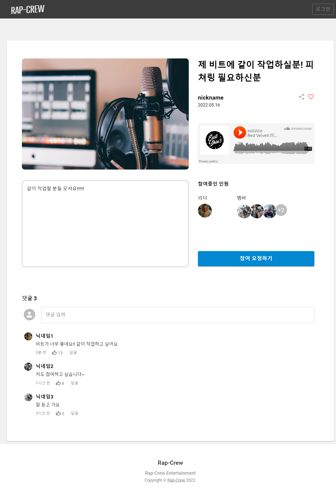

# Rap-Crew

<p align="center">
  <br>
  
  <br>
</p>


<p align="center">
  <br>
  
  <br>
</p>


## 프로젝트 소개

<p align="justify">
힙합 콜라보레이션, 단체곡, 믹스테잎 등 힙합 뮤지션들을 위한 구인 커뮤니티
</p>


###### Back 구현 repository는 https://github.com/eastshine12/Rap-Crew-API

<!-- <p align="center">
GIF Images
</p> -->

<br>

## 기술 스택
</a>&nbsp;
</a>&nbsp;
</a>&nbsp;
</a>&nbsp;
</a>&nbsp;

<br>

## 구현 기능

### 기능 1
구인 게시글 작성
  1. 제목, 내용 입력
  2. Soundcloud API 통한 음악 삽입 (구현 예정)
  3. 최대 크루원 수 지정
```
export default function card_add() {
    
    const router = useRouter();
    const styles = useStyles();
    const { data: session, status } = useSession();

    const [card, setCard] = useState ({
      title: '',
      content: '',
      recruitNum: 1,
      recruitAt: new Date(),
    });

    const onChangeValue = (e) => {
      setCard({
        ...card,
        [e.target.name] : e.target.value,
      });
    };

    const submitCardHandler = (e) => {
      e.preventDefault();

      const reqData = {
        title: card.title,
        content: card.content,
        recruitNum: card.recruitNum,
        recruitAt : card.recruitAt,
      }
      
      axios.post('/api/addCard', reqData, {
        headers: {
          'Content-type': 'application/json'
        },
      })
      .then(res => resultHandler(res));
    }

    const resultHandler = (res) => {
      if(res.data === 'OK') {
        alert('게시글이 등록되었습니다.');
        router.push('/');
      }
      else if(res.data === 'LOGIN') {
        alert('로그인 후에 이용 가능합니다.');
        router.push('/login');
      }
      else {
        alert('게시글 작성에 실패했습니다.')
      }
    };

```
     

### 기능 2
로그인
  1. NextAuth를 사용한 로그인 구현
```
export default NextAuth({
  site: process.env.NEXTAUTH_URL,
  secret: process.env.SECRET,
  providers: [
    CredentialsProvider({
      name: 'Rap-Crew',
      credentials: {
        loginId: { label: "아이디", type: "text", placeholder: "아이디를 입력하세요." },
        password: {  label: "비밀번호", type: "password" }
      },
      
      async authorize(credentials, req) {

        const user = await fetch(`${process.env.BASE_URL}/api/auth/signin`, {
          method: "POST",
          body: JSON.stringify(credentials),
          headers: {
            "Content-Type": "application/json",
          },
        });

        if (!user) {
          throw new Error('user not found.');
        };
        
        if (user) {
          return user
        }

        return null
    },
  }),
  ],
  callbacks: {
    session: async ({ session, token }) => {
      if (session?.user) {
        session.user.userNo = token.userNo;
        session.user.userId = token.userId;
        session.user.status = token.status;
      }
      return session;
    },
    jwt: async ({ user, token }) => {
      if (user) {
        token.userNo = user.userNo;
        token.userId = user.userId;
        token.status = user.status;
      }
      return token;
    },
  },
  session: {
    strategy: 'jwt',
  },
})
```

### 기능 3
댓글
  1. 로그인 시 각 게시글 마다 댓글 기능 구현 (프로필 이미지, ID, 내용, 입력 시각 표기 기능)
```
const changeTimeSet = (time) => {
  const today = new Date();
  const timeValue = new Date(time);

  const betweenTime = Math.floor((today.getTime() - timeValue.getTime()) / 1000 / 60);
  const betweenTimeHour = Math.floor(betweenTime / 60);
  const betweenTimeDay = Math.floor(betweenTime / 60 / 24);

  if (betweenTime < 1) return '방금 전';
  if (betweenTime < 60) return `${betweenTime}분 전`;
  if (betweenTimeHour < 24) return `${betweenTimeHour}시간 전`;
  if (betweenTimeDay < 365) return `${betweenTimeDay}일 전`;

  return `${Math.floor(betweenTimeDay / 365)}년 전`;
};
```
```
export default function Reply({replys}) {

  const styles = useStyles();
  const router = useRouter();
  const { data: session, status } = useSession();
  const { cardId }  = router.query;
  const [repls, setRepls] = useState(replys);
  const [replyContent, setReplyContent] = useState('');
  const [replyFocus, setReplyFocus] = useState(false);

  const refreshReply = async () => {
    try {
      const res = await axios.get(`/api/getReply/${cardId}`);

      if(res.status === 200) {
        setRepls(res.data);
      }
    } catch(err) {
      console.log(err);
    }
  };

  const replyBtnClickHandler = (e) => {
    e.preventDefault();
    const reqData = {
      cardId,
      content: replyContent,
    }
    axios.post('/api/addReply', reqData, {
      headers: {
        'Content-type': 'application/json'
      },
    })
    .then(res => resultHandler(res));
  };


  const resultHandler = (res) => {
    if(res.data === 'OK') {
      refreshReply();
      setReplyContent('');
    }
    else if(res.data === 'LOGIN') {
      alert('로그인 후에 이용 가능합니다.');
      router.push('/login');
    }
    else {
      alert('댓글 작성에 실패했습니다.')
    }
  };

// ...

}

```

### 기능 4
크루원 신청 및 가입
  1. 구인 게시글의 신청하기 클릭 시 리더에게 알람
  2. 리더는 신청 또는 가입 중인 크루원 확인

<br>

<!-- ## 배운 점 & 아쉬운 점 -->

<p align="justify">

</p>

<br>
